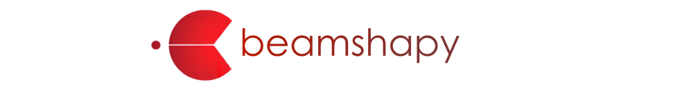
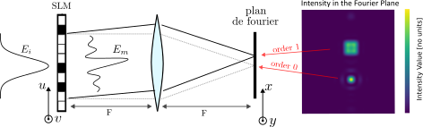

.. beamshapy documentation master file, created by
   sphinx-quickstart on Sun Nov  5 18:28:04 2023.
   You can adapt this file completely to your liking, but it should at least
   contain the root `toctree` directive.

beamshapy : laser beam shaping simulations
==========================================

beamshapy is a python-based tool that performs optical simulations for laser beam shaping.
We provide a package and a graphical user interface developed in PyQt5.

It is built upon the LightPipes toolbox and provides various methods for generating custom intensity and amplitude profiles with Spatial Light modulators (SLM).

Available **optical system architectures** are:

- Single fourier transform with phase modulation

- 4f fourier tranform with phase modulation and spatial filtering

Available amplitude/intensity profiles **generation methods** are:

- Weighted Gerchberg-Saxton algorithm
- Amplitude modulation of blazed gratings

Main Features
=============

beamshapy offers 3 main features :

- **Target Amplitude/Intensity design**: for specifying objective output field characteristics
- **Phase mask design**: for generating or designing SLM phase masks
- **Optical propagation**: for evaluating resulting output field

For more detailed information about each feature and further instructions, please visit our documentation.

.. toctree::
   :maxdepth: 2
   :caption: Contents:

   beamshapy

Indices and tables
==================

* :ref:`genindex`
* :ref:`modindex`
* :ref:`search`
